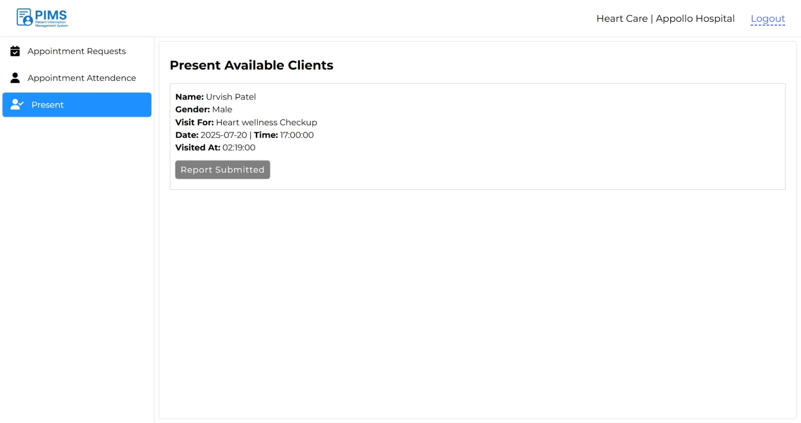

# 🏥 Patient Information Management System (PIMS)

## **📸 Screenshots**
### **1. Home page of Site. 🏠**
---

### **2. Staff Register and login page**
Where Admin can actual register and login, also Doctors and Department(nurse) only can login.

---

---

### **3. Admin Portals 👤**
To setup hospital, Admin plays most important role here. Fills hospital info and generate Doctors' and Departments' credentials to login.

---

Creates Departments with dept_email and password.
---

List Departments info with Updation feature.
---

Add Doctor info with Email and password, selecting department to work with using select menu.
---

List Doctors info with Updation feature.
---

### **3. User Portals 😷**
To connect with Doctor, User register and login individual from personal credentials from Register & Login page. Fills personal info and register to book appointments.

---

---

After valid Login, redirect to User portal. users can update their details.
---

Users appointment booking.
---

---

After Placing Appointment, User can Track Status of request.
---

### All the stage filters are working perfectly with different stages.
* if no action by department, stay pending.
* department approves request, lays into Approved.
* department reject request, thrown into Rejected.

Users can See their all appointment reports which they submitted.
---

and can see the Prescriptions in order to take medicine on time. 
---

### **3. Department Portals 👩🏻‍⚕️**
To Approve and Reject Appointment and for available offline patient attendence, all done by department(nurse) portal using credential like `dept_email` and `dept_pass` which admin created. Logged in from Staff page and department login. and then redirect to department portal.

---

on approving request. it listed in attendence menu, that when ever user visit hospital, it will remark as present.
---

After make user petient present. it listed in present section, that list all visited users as appointment. still it can be modificable if mistaken Present, nurse can do Delete. that show back in Appointment attendance. until not reviewed by doctor.
---

After visiting a doctor, same present status not allow to modify.
---

### **4. Doctor Portal 🧑🏻‍⚕️**
Approved Appointment from Department portal, the approved and Present user request listed in available patient tab. Doctor can make report and listed all attended reports. also after submit, Doctor can update prescription and report if there is some mistaken.

---

---

---

### *5. feature*
### - It allows multiple hospital to register in by mulitple Admins. also more than single departments and doctors can be easily handled in database. even Users can independently register and login. all are well structured in database. ✨⚕️
---
Thank you for Showing Interest.😇
Open to contribute. 🫱🏻‍🫲🏻
---

@ Project By Urvish Patel